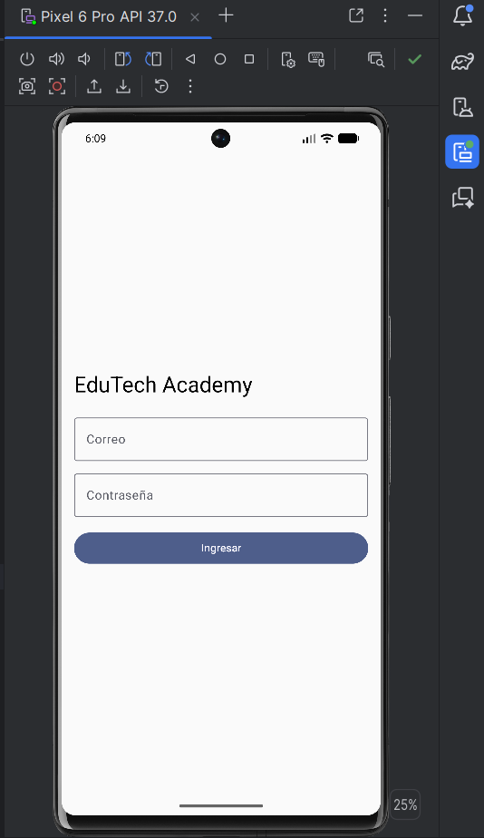
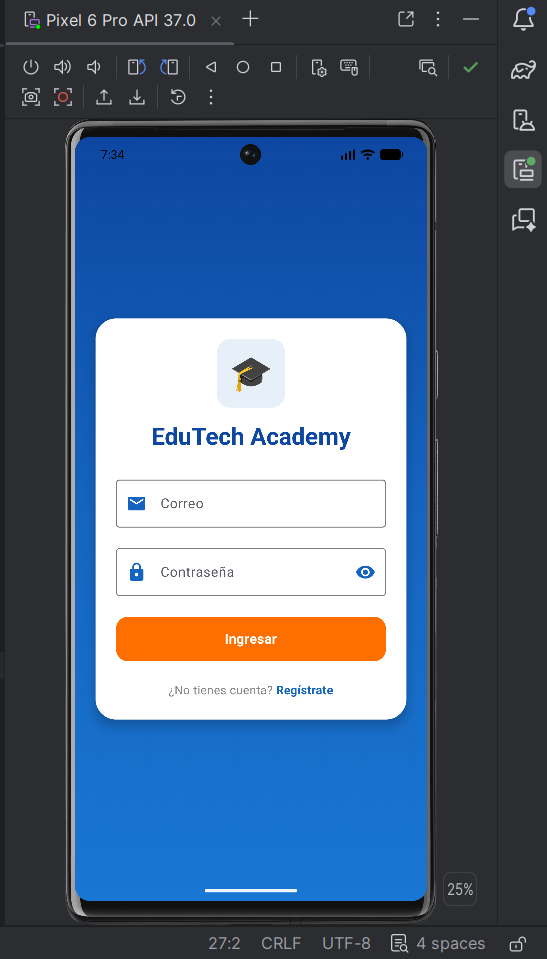
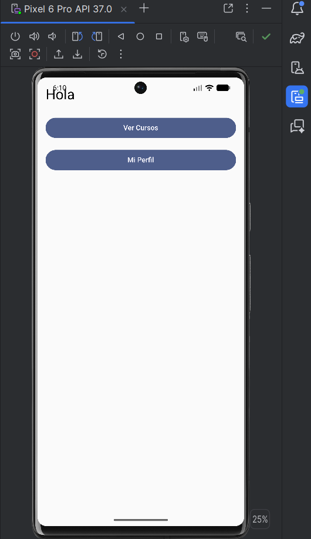
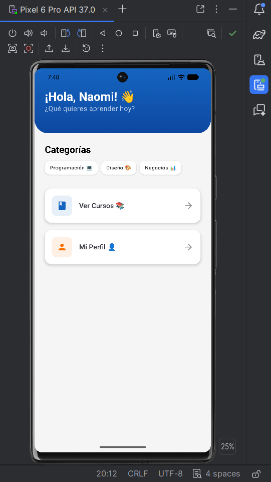
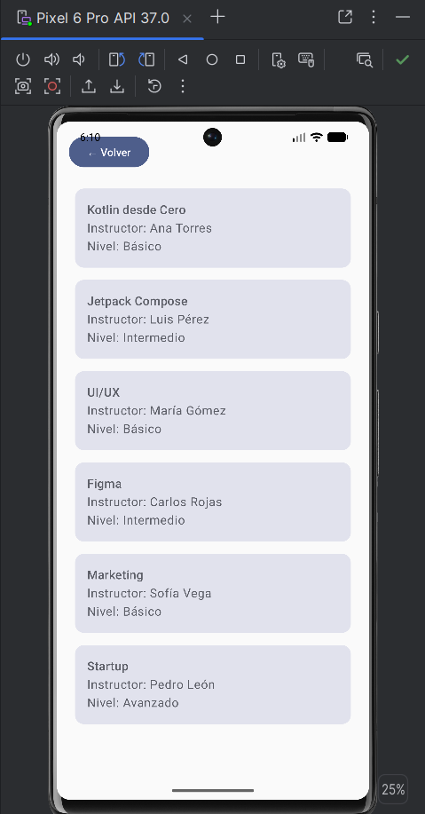
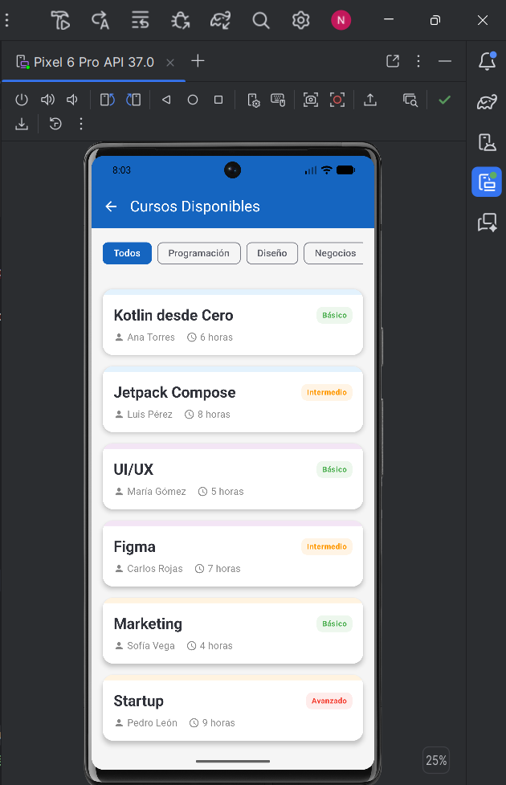
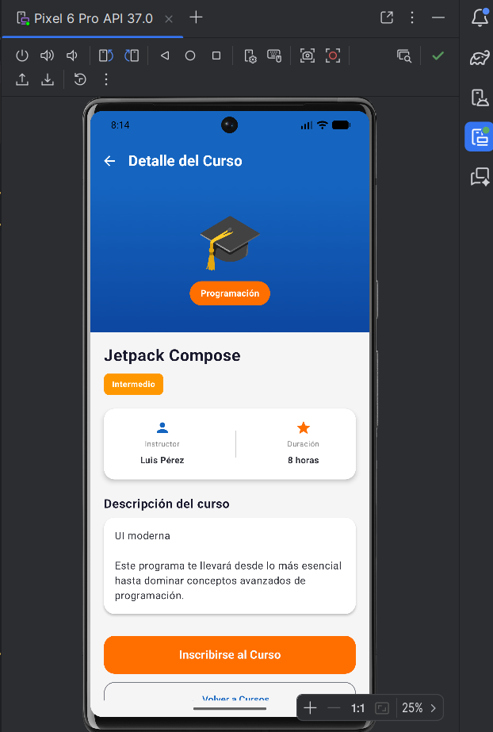
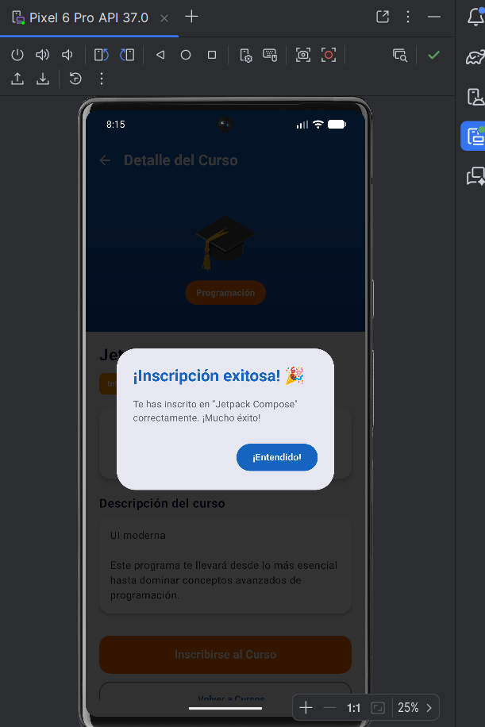
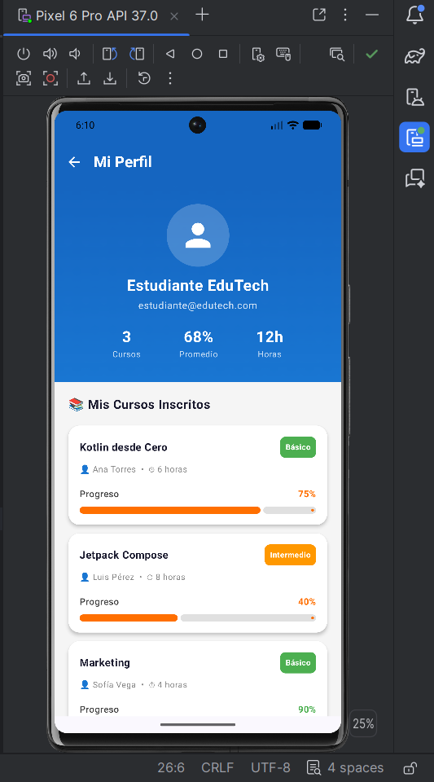
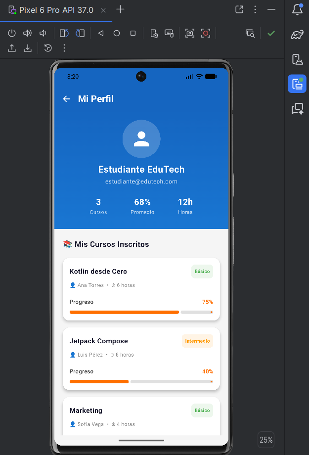

# 🤖 MEJORAS_GEMINI.md — EduTech Academy

Documentación del proceso de mejora UI/UX realizado con **Gemini in Android Studio** como parte de la Etapa 2 del proyecto grupal.

**Integrante:** Naomi Sanchez  
**Herramienta:** Gemini in Android Studio  
**Pantallas auditadas y mejoradas:** 5

---

## ✅ Mejora #1 — LoginScreen

### 📸 Antes vs Después

| Antes | Después |
|-------|---------|
|  |  |

### 💬 Prompt usado en Gemini

> Mejora el diseño UI/UX de esta pantalla de Login en Jetpack Compose con las siguientes mejoras:
> 1. Fondo con gradiente azul vertical usando los colores #0D47A1, #1565C0 y #1976D2 en lugar del fondo blanco vacío
> 2. Agrega un logo o ícono de graduación 🎓 arriba del formulario dentro de un Surface con esquinas redondeadas
> 3. Moderniza los campos de texto: agrega ícono de email en el campo correo y ícono de candado en contraseña, además agrega un ícono de ojo para mostrar u ocultar la contraseña usando VisualTransformation
> 4. Agrega validación visual: si el usuario presiona Ingresar con campos vacíos, muestra un mensaje de error en rojo que diga "Por favor completa todos los campos"
> 5. Rediseña el botón Ingresar con color naranja #FF6F00, esquinas redondeadas de 14.dp y altura de 52.dp
> 6. Agrega al final del formulario el texto "¿No tienes cuenta? Regístrate" donde Regístrate esté en azul #1565C0 y en negrita
> 7. Envuelve todo el formulario dentro de una Card blanca con esquinas redondeadas de 24.dp para darle profundidad
> 8. Mantén exactamente la misma lógica de navegación con onLogin() sin cambiarla
> 9. Usa Material 3 y paleta de colores azul #1565C0 y naranja #FF6F00

### 🔧 Mejoras implementadas
- Fondo con gradiente azul degradado
- Logo 🎓 con Surface redondeado
- Campos con íconos de email y candado
- Ícono de ojo para mostrar/ocultar contraseña
- Validación con mensaje de error en rojo
- Botón naranja moderno con esquinas redondeadas
- Texto "¿No tienes cuenta? Regístrate"
- Formulario dentro de Card blanca con sombra

### 💭 Reflexión
Gemini transformó una pantalla completamente básica en una interfaz moderna y profesional. La adición del gradiente azul y la Card blanca generó una jerarquía visual clara. Las validaciones mejoran significativamente la experiencia del usuario.

---

## ✅ Mejora #2 — HomeScreen

### 📸 Antes vs Después

| Antes | Después |
|-------|---------|
|  |  |

### 💬 Prompt usado en Gemini

> Mejora el diseño UI/UX de esta pantalla Home en Jetpack Compose con las siguientes mejoras:
> 1. Agrega un header con fondo degradado azul #1565C0 que ocupe la parte superior con un saludo personalizado "¡Hola, Naomi! 👋" en texto blanco grande y negrita, y debajo un subtítulo "¿Qué quieres aprender hoy?" en blanco semitransparente
> 2. Reemplaza los botones simples por Cards modernas con sombra, esquinas redondeadas de 16.dp, un ícono representativo a la izquierda y flecha → a la derecha. Una Card para "Ver Cursos 📚" y otra para "Mi Perfil 👤"
> 3. Agrega una sección "Categorías" debajo con 3 chips o badges pequeños que digan "Programación 💻", "Diseño 🎨" y "Negocios 📊"
> 4. Usa fondo gris claro #F5F5F5 para el cuerpo de la pantalla
> 5. Usa Material 3, paleta azul #1565C0 y naranja #FF6F00
> 6. Mantén exactamente las mismas funciones onCoursesClick() y onProfileClick() sin cambiarlas

### 🔧 Mejoras implementadas
- Header con gradiente azul y saludo personalizado
- Cards modernas con íconos y flecha de navegación
- Sección de categorías con chips/badges
- Fondo gris claro para mejor contraste
- Jerarquía visual mejorada

### 💭 Reflexión
La pantalla Home pasó de tener dos botones simples a un dashboard moderno con header impactante. Las Cards con íconos hacen la navegación más intuitiva. Los chips de categorías anticipan al usuario los tipos de contenido disponibles.

---

## ✅ Mejora #3 — CoursesScreen

### 📸 Antes vs Después

| Antes | Después |
|-------|---------|
|  |  |

### 💬 Prompt usado en Gemini

> Mejora el diseño UI/UX de esta pantalla de lista de Cursos en Jetpack Compose con las siguientes mejoras:
> 1. Agrega un TopAppBar azul #1565C0 con título "Cursos Disponibles" en blanco y botón flecha atrás ← en blanco
> 2. Reemplaza el botón "← Volver" simple por el botón de navegación dentro del TopAppBar
> 3. Mejora las Cards de cada curso: agrega un banner de color según categoría, muestra el título en negrita, instructor con ícono de persona 👤, nivel con badge de color (verde=Básico, naranja=Intermedio, rojo=Avanzado) y duración con ícono de reloj
> 4. Agrega filtros por categoría arriba de la lista usando FilterChip con opciones: Todos, Programación, Diseño, Negocios. Al seleccionar un filtro la lista se actualiza
> 5. Usa fondo gris claro #F5F5F5 y Cards blancas con sombra elevation 4.dp y esquinas redondeadas 16.dp
> 6. Usa Material 3, paleta azul #1565C0 y naranja #FF6F00
> 7. Mantén exactamente las mismas funciones onBack() y onCourseClick(course.id) sin cambiarlas

### 🔧 Mejoras implementadas
- TopAppBar azul con botón de retroceso
- FilterChips funcionales por categoría
- Cards con badges de nivel por color
- Íconos de instructor y duración
- Fondo gris con Cards blancas con sombra

### 💭 Reflexión
La pantalla de cursos mejoró drásticamente con los filtros por categoría, permitiendo al usuario encontrar cursos más rápido. Los badges de color por nivel hacen la información más escaneable visualmente.

---

## ✅ Mejora #4 — CourseDetailScreen

### 📸 Antes vs Después

| Antes | Después |
|-------|---------|
|  |  |

### 💬 Prompt usado en Gemini

> Mejora el diseño UI/UX de esta pantalla de Detalle del Curso en Jetpack Compose con las siguientes mejoras:
> 1. Agrega un TopAppBar azul #1565C0 con título "Detalle del Curso" en blanco y botón flecha atrás ← en blanco
> 2. Reemplaza el banner superior por un Box con gradiente azul de #1565C0 a #0D47A1 de altura 220.dp que muestre el ícono 🎓 grande en el centro y un badge naranja con la categoría del curso
> 3. Muestra el título del curso en texto grande negrita 24.sp debajo del banner
> 4. Agrega un badge de color para el nivel: verde para Básico, naranja para Intermedio y rojo para Avanzado
> 5. Crea una Card blanca con sombra que muestre en dos columnas: instructor con ícono de persona y duración con ícono de estrella
> 6. Agrega una sección "Descripción del curso" con el texto dentro de una Card blanca con padding
> 7. El botón "Inscribirse" debe ser naranja #FF6F00, ancho completo, altura 56.dp y al presionarlo muestra un AlertDialog de confirmación que diga "¡Inscripción exitosa! 🎉"
> 8. Agrega un botón secundario OutlinedButton "← Volver a Cursos" debajo del botón principal
> 9. Usa fondo gris claro #F5F5F5, Material 3 y mantén exactamente los mismos parámetros courseId y onBack()

### 🔧 Mejoras implementadas
- TopAppBar azul con navegación
- Banner con gradiente y badge de categoría
- Badge de nivel con colores
- Card con información de instructor y duración
- AlertDialog de confirmación al inscribirse
- Botón secundario de retroceso

### 💭 Reflexión
El detalle del curso se transformó en una pantalla rica en información visual. El AlertDialog de confirmación de inscripción mejora el feedback al usuario. La jerarquía visual con banner, badges y cards organiza mejor el contenido.

---

## ✅ Mejora #5 — ProfileScreen

### 📸 Antes vs Después

| Antes | Después |
|-------|---------|
|  |  |

### 💬 Prompt usado en Gemini

> Mejora el diseño UI/UX de esta pantalla de Perfil en Jetpack Compose con las siguientes mejoras:
> 1. Agrega un TopAppBar azul #1565C0 con título "Mi Perfil" en blanco y botón flecha atrás ← en blanco
> 2. Crea un header con gradiente azul #1565C0 a #1976D2 que contenga: avatar circular con ícono de persona, nombre "Estudiante EduTech" en blanco negrita, email "estudiante@edutech.com" en blanco semitransparente, y 3 estadísticas en fila: Cursos, Promedio 68% y Horas 12h
> 3. Agrega una sección "📚 Mis Cursos Inscritos" con título en negrita
> 4. Muestra cada curso inscrito en una Card blanca con sombra que tenga: título en negrita, badge de nivel con color (verde=Básico, naranja=Intermedio, rojo=Avanzado), instructor y duración en texto pequeño
> 5. Agrega una LinearProgressIndicator por cada curso con su porcentaje de progreso al lado en naranja o verde si supera 80%
> 6. Si no hay cursos inscritos muestra un estado vacío con emoji 📭 y texto "Aún no tienes cursos inscritos"
> 7. Usa LazyColumn para la lista, fondo gris claro #F5F5F5, Material 3 y mantén exactamente el mismo parámetro onBack()

### 🔧 Mejoras implementadas
- TopAppBar azul con navegación
- Header con gradiente, avatar circular y estadísticas
- Cards de cursos con badges de nivel
- LinearProgressIndicator por cada curso
- Estado vacío con emoji 📭
- LazyColumn para scroll eficiente

### 💭 Reflexión
La pantalla de perfil pasó de ser inexistente a una pantalla completa y profesional. Las barras de progreso simuladas dan al usuario una sensación real de avance en sus cursos. El header con estadísticas agrega valor inmediato a la experiencia.

---

## 📊 Resumen de mejoras

| Pantalla | Mejoras aplicadas |
|----------|-------------------|
| LoginScreen | Gradiente, validaciones, ícono ojo, Card formulario |
| HomeScreen | Header gradiente, Cards modernas, chips categorías |
| CoursesScreen | TopAppBar, FilterChips, badges de nivel |
| CourseDetailScreen | Banner gradiente, AlertDialog inscripción, badges |
| ProfileScreen | Header con stats, barras de progreso, estado vacío |

**Total de mejoras implementadas: 20+ mejoras UI/UX**
